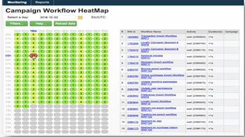
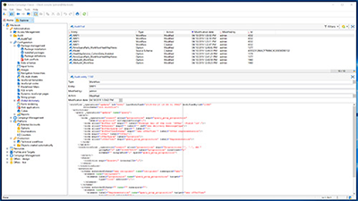
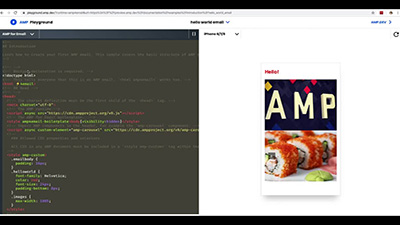

# Adobe Campaign Classic 자습서 - 개요

Adobe Campaign은 크로스채널 고객 경험을 디자인할 수 있는 플랫폼을 제공하며 시각적 캠페인 오케스트레이션, 실시간 상호 작용 관리 및 크로스채널 실행 환경을 제공합니다. 이 사용자 안내서에는 Adobe Campaign Classic의 다양한 기능과 성능에 대한 비디오 및 자습서가 포함되어 있습니다.

## 새로운 기능

* **[CNAME(베타)을 사용하여 하위 도메인 위임](/help/control-panel-tutorials/subdomains-and-certificates/delegating-subdomains-using-cname.md)**

   *Campaign 컨트롤 패널에서 CNAME을 사용하여 하위 도메인을 설정하고 제출하는 방법을 알아봅니다.*

* **[데이터베이스 모니터링](/help/control-panel-tutorials/performance-monitoring/monitoring-databases.md)**

   *인스턴스의 데이터베이스 사용을 모니터링하는 방법을 알아봅니다.*

## 직원 추천

<table>
<tr>
  <td>
    
    

      <a href="./monitoring-campaign-classic/workflow-heatmap.md">
    <strong>워크플로우 Heatmap</strong>
    </a>
    

    

    <em>동시 실행 워크플로우의 수에 대한 개요를 살펴보십시오.</em>
    

  </td>
   <td>
    
    

      <a href="./monitoring-campaign-classic/audit-trail.md">
    <strong>감사 추적</strong>
    </a>
    
 
    

    <em>Adobe Campaign 내에서 발생하는 작업 및 이벤트의 포괄적인 목록을 캡처합니다.</em>
    

  </td>
  <td>
    
    

      <a href="./sending-messages/email-channel/defining-interactive-email-content-with-amp.md">
    <strong>AMP를 사용하여 인터랙티브한 이메일 콘텐츠 정의</strong>
    </a>
    

    

    <em>Adobe Campaign Classic에서 AMP를 활성화하고 사용하는 방법을 알아봅니다 </em>
    

  </td>
</tr>
</table>

## 추가 리소스

* [설명서](https://docs.adobe.com/content/help/ko-KR/campaign-classic/using/getting-started/starting-with-adobe-campaign/about-adobe-campaign-classic.html)
